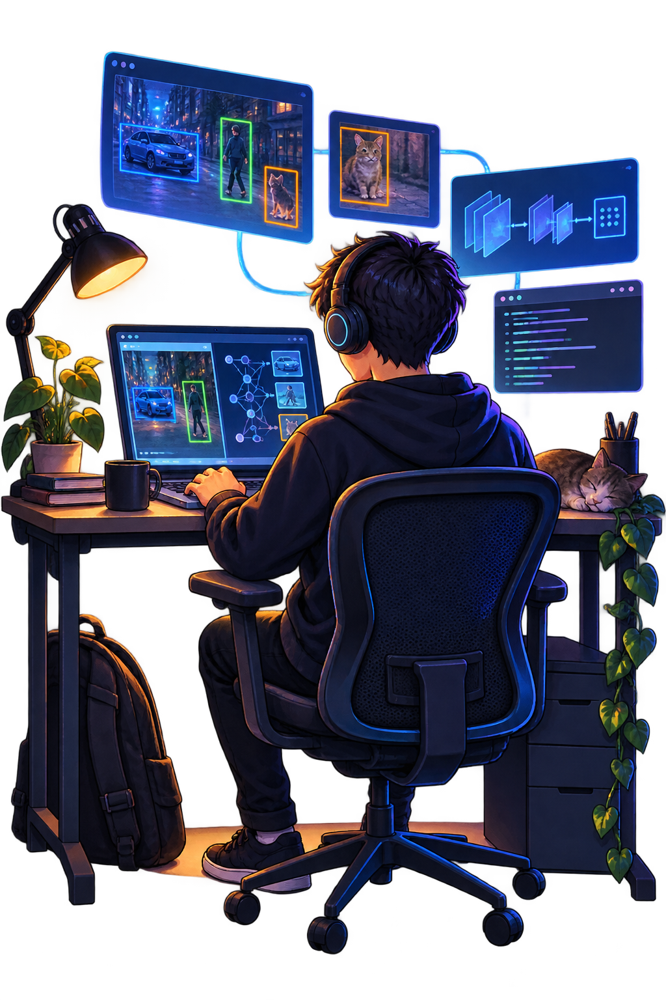

### Привет, я Макс 👋

**Пишу инструменты на Python для компьютерного зрения и автоматизации.**

Работаю с данными и моделями, создаю API и небольшие интерфейсы для запуска и проверки результата.

 

  
  
  

### Избранные проекты

- **[Auto Layout AI](https://github.com/Kan1es/auto-layout-ai)** — локальный сервис для авторазметки изображений и подготовки YOLO-экспорта для CVAT.
- **[Safety Harness](https://github.com/Kan1es/safety-harness)** — исследование и прототип детекции страховочных поясов на изображениях с помощью YOLO11s.
- **[Encryptor Voice](https://github.com/Kan1es/encryptor_voice)** — Telegram-бот, который превращает голосовые сообщения и видеокружки в текст.

### На связи

Если хотите обсудить проект или задать вопрос по одному из репозиториев, напишите мне в Telegram.

